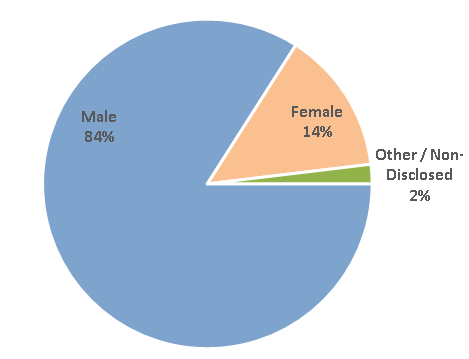

# pandas-challenge

This is a mock project that was developed for a fictional independent gaming company where the goal was to analyze the data for their most recent fantasy game **Heroes of Pymoli**.

  

The game is free-to-play, but players are encouraged to purchase optional items that enhance their playing experience. The main goal was to generate a report that breaks down the game's purchasing data into meaningful insights for the following:-

* Total Number of Players
* Purchasing Analysis
* Player Gender Demographic
* Purchasing Analysis by Player Gender
* Age Demographics of Players
* Top Spenders among the Players
* Most _Popular_ and _Profitable_ items

## What this contains:

The repo contains two jupyter notebooks, two .pdf files and one excel workbook. The file descriptions is shown beloe:
1. **HeroesOfPymoli_HW4.ipynb** - The main jupyter notebook with complete solutions of the HW4.
2. **HeroesOfPymoli_HW4.pdf** - contains the .pdf version of the HW4 jupyter notebook described in (1). For some reason, GitHub fails to render the notebook properly. The pdf was generated for easy readability.
3. **HeroesOfPymoli_HW4_Storyboard.xlsx** - After completing the homework activities, all the corresponding _summary_ dataframes etc. were collected in a list and written to an Excel workbook to create data visualizations and report generation. At the time of this analysis, I was not comfortable with using matplotlib, hence chose Excel to create the report.
4. **HeroesOfPymoli_HW4_Report.pdf** - The pdf version of the report which concolidates the visualizations and analysis. Also contains an appendix which contains a one-page discussion on a potential data consistency issue which was spotted in the very beginning of the assignment.
5. **HeroesOfPymoli_data_issue.ipynb** - contains some coding and manipulation of the original dataframe which was performed to highlight the data consistency issues as discussed in (4) above.
